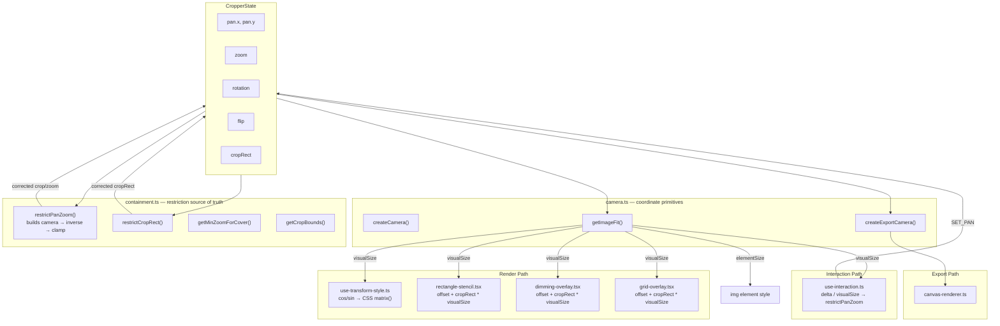

# Image Editor — Architecture

## Coordinate Spaces

| Space | What lives here | Coordinates |
|-------|----------------|-------------|
| **World** | Image, crop rect | Normalized 0–1, origin top-left of image |
| **Camera** | View transform (zoom, pan, rotation, flip) | A `mat2d` mapping world → screen |
| **Screen** | DOM container, mouse events, CSS | Pixels relative to container |

## Data Flow

The camera is the source of truth for restriction (ensuring the image covers the crop). The render path uses lightweight manual math for CSS transforms and stencil positioning — these are simple, correct, and deliberately not routed through the camera to avoid prop-threading complexity.

### Design decisions

**Why restriction uses the camera but rendering doesn't:**
- `restrictPanZoom` builds a camera internally and projects crop corners through its inverse. This guarantees the restriction and rendering agree on geometry — the camera IS the screen transform.
- The render path (`use-transform-style`, stencils, overlays) uses simple manual math because the CSS transform operates in a different coordinate system (element-center origin vs container-center). Deriving CSS matrix from the camera mat2d would be more complex, not less.

**Why `getImageFit` exists:**
- `createCamera` needs to know the fitted image dimensions to build its matrix. `cropper.tsx` also needs them to size the `` element and compute `visualSize` for overlays. `getImageFit` is the shared contain-fit calculation used by both — no duplication.

**UX invariant:**
> After `restrictPanZoom`, transforming the 4 crop corners through `screenToWorld(camera, corner)` must produce world points inside [0,1]×[0,1].

This is both the restriction algorithm AND the test. If the camera says it's covered, it's covered on screen — because the camera IS the screen transform.

## Extension points

See [recipes.md](recipes.md) for the full developer guide. Summary:

| Extension | Mechanism |
|-----------|-----------|
| Custom crop area UI | `stencil` prop — any component implementing `StencilProps` |
| AI agent control | `TransformOperation[]` pipeline — JSON-serializable, replayable |
| Custom export | `exportCroppedImage()` or `applyToCanvas()` for multi-step pipelines |
| Theming | BEM CSS classes (`.wp-media-editor-image-editor__*`) |
| State observation | `onStateChange` (every frame), `onGestureStart`/`onGestureEnd` (gesture boundaries) |
| Undo/redo | Snapshot state at gesture boundaries, `RESET` to restore — see recipes.md |

